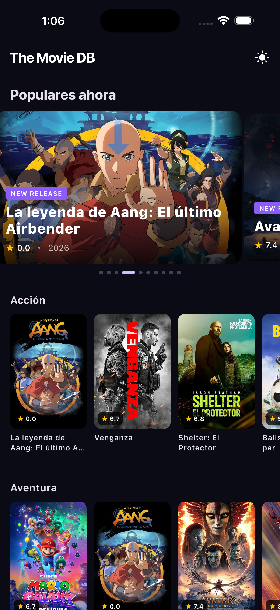
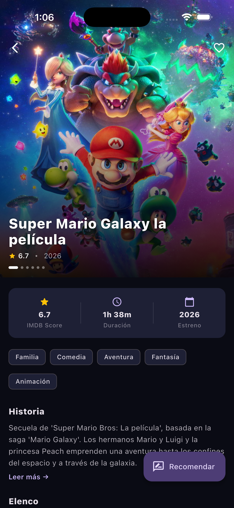

# The Movie DB

<p align="center">
  App Flutter construida para el <strong>PinApp Mobile Architecture Challenge</strong>.<br/>
  Categorías de películas con listas anidadas, detalle con carrusel de imágenes,<br/>
  sistema de recomendaciones con Firestore y soporte offline con caché local.
</p>

<p align="center">
  <a href="https://github.com/JosueLemus/the-movie-db-flutter/actions/workflows/main.yaml">
    
  </a>
  
  
  
  
</p>

---

## Demo

> Reemplazá las imágenes de abajo con tus capturas o GIFs de la app en acción.

| Inicio | Detalle | Modal de recomendación | Sin conexión |
|:------:|:-------:|:----------------------:|:------------:|
|  |  |  |  |

---

## Arquitectura

El proyecto sigue **Clean Architecture** con tres capas claramente separadas:

```
lib/
├── app/                        # Entry point & theme notifier
├── core/
│   ├── di/                     # Inyección de dependencias (GetIt)
│   ├── env/                    # Configuración de flavors (dev/staging/prod)
│   ├── network/                # Cliente Dio, interceptores, NetworkException
│   ├── router/                 # Rutas con GoRouter
│   ├── services/               # RemoteConfigService, ConnectivityService
│   ├── theme/                  # Temas claro y oscuro
│   └── widgets/                # Widgets compartidos (ConnectivityBanner)
└── features/
    ├── movies/
    │   ├── data/               # Modelos, DataSources (remote/local), RepositoryImpl
    │   ├── domain/             # Entidades, UseCases, interfaces de Repository
    │   └── presentation/       # BLoC/Cubits, Pages, Widgets
    └── splash/
        ├── data/               # SplashRepositoryImpl
        ├── domain/             # Caso de uso InitializeApp
        └── presentation/       # SplashCubit, SplashPage
```

**Flujo de datos:** `UI → Cubit/BLoC → UseCase → Repository → DataSource (remote o caché local)`

---

## Stack tecnológico

| Categoría | Librería | Versión |
|---|---|---|
| Manejo de estado | `flutter_bloc` / `bloc` | 9.1.1 / 9.2.0 |
| Networking | `dio` | 5.9.1 |
| Firebase | `firebase_core` / `firebase_remote_config` / `cloud_firestore` | 3.13.1 / 5.4.6 / 5.6.9 |
| Analytics | `firebase_analytics` | 11.4.6 |
| Inyección de dependencias | `get_it` | 9.2.0 |
| Navegación | `go_router` | 14.8.1 |
| Caché local | `hive` / `hive_flutter` | 2.2.3 / 1.1.0 |
| Preferencias | `shared_preferences` | 2.5.3 |
| Imágenes | `cached_network_image` | 3.4.1 |
| Carrusel | `carousel_slider_plus` | 7.1.1 |
| Conectividad | `connectivity_plus` | 6.1.4 |
| Shimmer loading | `shimmer` | 3.0.0 |
| HTML rendering | `flutter_widget_from_html_core` | 0.15.2 |
| Igualdad | `equatable` | 2.0.7 |
| **Testing** | `bloc_test` / `mocktail` | 10.0.0 / 1.0.5 |

---

## Correr el proyecto

### Requisitos previos

- **Flutter:** 3.41.x  
- **Dart:** 3.11.x  
- Token de API de [The Movie DB](https://www.themoviedb.org/settings/api) (Bearer token)

### Pasos

```sh
git clone https://github.com/JosueLemus/the-movie-db-flutter.git
cd the-movie-db-flutter
flutter pub get
```

El token de TMDB se pasa en tiempo de compilación con `--dart-define`. No es necesario tocar ningún archivo de código:

```sh
# Development (recomendado)
flutter run \
  --flavor development \
  --target lib/main_development.dart \
  --dart-define=TMDB_API_KEY=TU_BEARER_TOKEN_ACA

# Staging
flutter run \
  --flavor staging \
  --target lib/main_staging.dart \
  --dart-define=TMDB_API_KEY=TU_BEARER_TOKEN_ACA

# Production
flutter run \
  --flavor production \
  --target lib/main_production.dart \
  --dart-define=TMDB_API_KEY=TU_BEARER_TOKEN_ACA
```

Reemplazá `TU_BEARER_TOKEN_ACA` con tu Bearer token de [The Movie DB](https://www.themoviedb.org/settings/api).

### Firebase

El proyecto usa **dos proyectos Firebase** ya configurados (uno por ambiente):

| Flavor | Proyecto Firebase | Archivo de opciones |
|---|---|---|
| `development` / `staging` | Firebase Dev | `lib/firebase/firebase_options_dev.dart` |
| `production` | Firebase Prod | `lib/firebase/firebase_options_prod.dart` |

Los archivos `google-services.json` (Android) y `GoogleService-Info.plist` (iOS) ya están incluidos en el repositorio para ambos ambientes. **No es necesario crear ni configurar un proyecto Firebase propio.**

Servicios utilizados:

| Servicio | Uso |
|---|---|
| **Remote Config** | Lee `welcome_message` y `maintenance_mode` al iniciar (Splash). Fallback a `SharedPreferences` cuando no hay conexión. |
| **Cloud Firestore** | Almacena y consulta recomendaciones de películas en la colección `recommendations/{movieId}/entries`. |
| **Analytics** | Registro de eventos de navegación. |

---

## Endpoints de la API

Base URL: `https://api.themoviedb.org/3` · Idioma: `es-AR`

| Endpoint | Propósito |
|---|---|
| `GET /genre/movie/list` | Categorías de películas |
| `GET /discover/movie?with_genres={id}` | Películas por género |
| `GET /movie/popular` | Populares para el carrusel del inicio |
| `GET /movie/{id}?append_to_response=images` | Detalle completo + imágenes |
| `GET /movie/{id}/credits` | Elenco |

Imágenes: `https://image.tmdb.org/t/p/w500{path}` (posters) · `https://image.tmdb.org/t/p/w1280{path}` (backdrops)

---

## Funcionalidades

- **Inicio** — categorías con listas horizontales anidadas, carrusel "Populares ahora" con auto-play
- **Detalle de película** — carrusel deslizable de imágenes (backdrops), overlay de título, stats, chips de género, sinopsis expandible (HTML), lista de elenco, animación Hero desde la tarjeta
- **Favoritos** — toggle con persistencia local en Hive
- **Recomendar** — modal con tags (FilterChip), comentario opcional, lista de recomendaciones anteriores, toast de éxito al confirmar (Firestore)
- **Offline** — caché Hive para géneros, películas por género, populares y detalle; banner rojo al perder conexión, banner verde al reconectarse (activado por primera request exitosa)
- **Temas** — toggle claro/oscuro con esquema de color persistente
- **Splash** — lee `welcome_message` y `maintenance_mode` de Firebase Remote Config con fallback a `SharedPreferences`

---

## Principios SOLID en el código

| Principio | Archivo | Descripción |
|---|---|---|
| **S** — Single Responsibility | [`lib/features/movies/domain/usecases/get_movie_detail.dart`](lib/features/movies/domain/usecases/get_movie_detail.dart) | Cada use-case tiene exactamente una responsabilidad |
| **O** — Open/Closed | [`lib/features/movies/data/repositories/movie_repository_impl.dart`](lib/features/movies/data/repositories/movie_repository_impl.dart) | La estrategia de caché se extiende sin modificar el dominio |
| **I** — Interface Segregation | [`lib/features/movies/domain/repositories/recommendation_repository.dart`](lib/features/movies/domain/repositories/recommendation_repository.dart) | Interfaz separada para que consumidores de recomendaciones no dependan de operaciones de películas |
| **D** — Dependency Inversion | [`lib/core/di/injection_container.dart`](lib/core/di/injection_container.dart) | Los use-cases y cubits dependen de abstracciones; los tipos concretos solo se referencian en la raíz de composición |

---

## Tests

```sh
flutter test --coverage
```

**Cobertura:** 81% (266 tests — unitarios, widget, bloc, integración)

Para ver el reporte HTML (requiere `lcov`):

```sh
genhtml coverage/lcov.info -o coverage/html
open coverage/html/index.html
```

---

## CI

GitHub Actions corre en cada push/PR a `main` usando [Very Good Workflows](https://github.com/VeryGoodOpenSource/very_good_workflows):

- `dart format` check
- `flutter analyze` (cero warnings/infos permitidos)
- `bloc lint`
- Tests con `--min-coverage 80`
- Spell check en archivos `.md`
